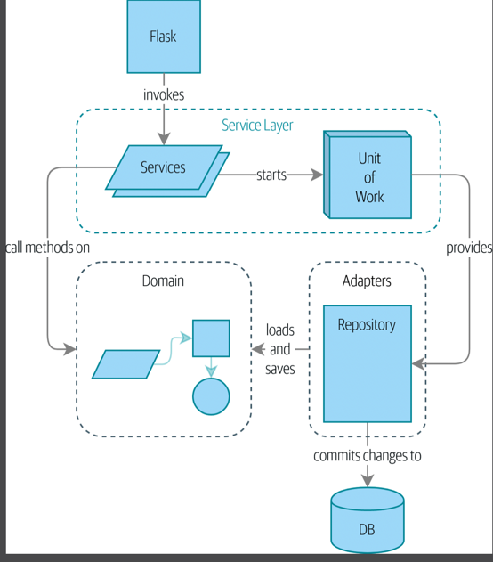
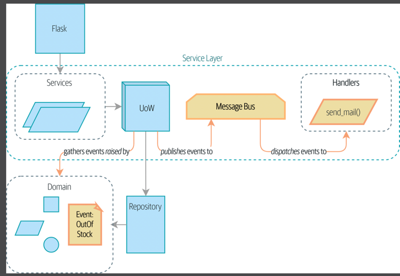

# programacao-web-backend

## Projeto

Esse projeto irá conter um backend para um sistema de gestão médica. 

O sistema usará inicialmente uma estrutura de monolito modular, dividido em camadas por domínios e dentro de cada domínio, por módulos.
Após a conclusão do monolito, será feita a migração para uma arquitetura de microsserviços, com event-driven designing.

## Tecnologias

- Python
- Flask
- Docker
- PostgreSQL
- SQLAlchemy
- Pytest

Requisitos necessários

- Controle de Login/Acesso
- Arquitetura
- Deploy CI/CD
- Testes
